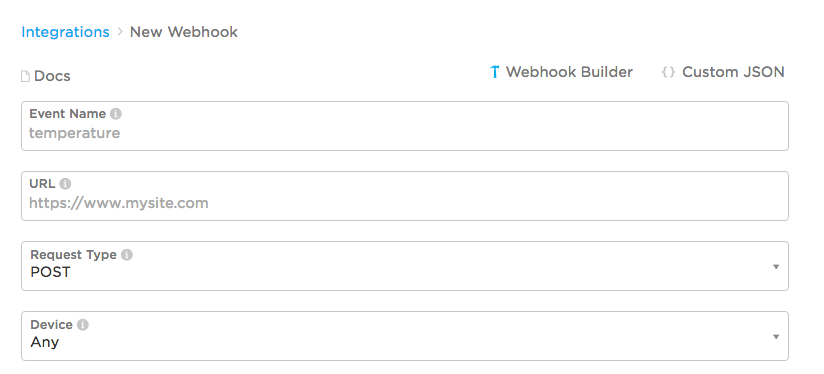
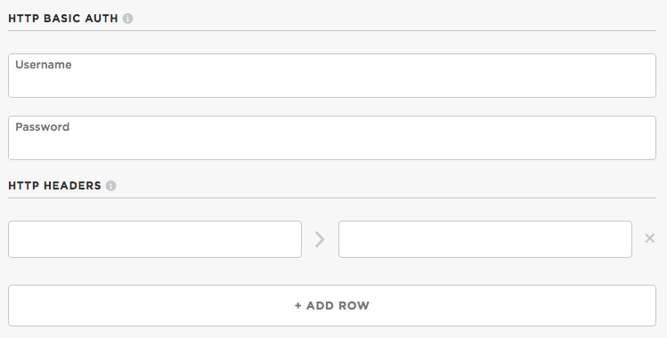
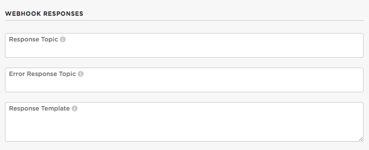
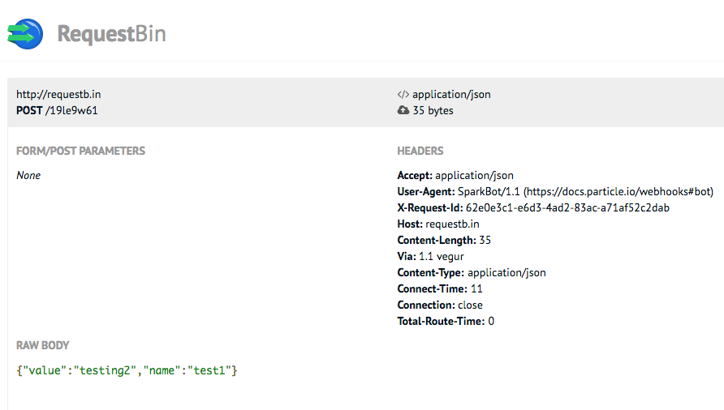

# Particle Webhooks Intermediate Tutorial

Particle webhooks are a great way to integrate your Particle Photon or Electron with APIs for web services on the Internet. If you're new to webhooks, you should start at [the official Particle guide for webhooks] (https://docs.particle.io/guide/tools-and-features/webhooks/) before continuing on here.

Before we get too far, this tutorial assumes you're familar with [JSON files] (http://www.w3schools.com/json/). JSON is a text-based data exchange format for passing data between devices or to and from APIs. As a refresher, the link at the beginning of this paragraph may be helpful.


## Using the Webhook Builder
The basics of the webhook builder are described in the [documentation] (https://docs.particle.io/guide/tools-and-features/webhooks/) but I'll include a few handy tips here.

I'll also include the mappings between the fields in the webhook builder and the Custom JSON file here, even though the Custom JSON option is the next section. If you're curious, you can jump ahead and come back. 



The *Event Name* field corresponds to what you pass as the `eventName` when you call `Particle.publish` on your Photon or Electron. Note that it is a prefix. So if you have an event name of "test" and the Photon sends "test1" the webhook will be called. You can use this to your advantage for some handy webhook tricks, discussed later. It corresponds to the "event" field in the Custom JSON.

The *URL* field corresponds to the "url" field in the Custom JSON. Query parameters (after the ?) are included in *Query Parameters*, below.

The *Request Type* is the type of request to make the the URL specified above. If you can type the request URL into the browser's URL bar and get a valid response back, it's GET. In most cases, it's POST. It corresponds to the "requestType" field in the Custom JSON and must be one of the strings: "GET", "POST", "PUT", or "DELETE".

The *Device* parameter allows you to choose which device (by its device name) to respond to. This corresponds to the "deviceID" field in the Custom JSON. You can also use the "mydevices" boolean parameter in the Custom JSON; true corresponds to PRIVATE events send from your devices only.


For POST or PUT request types, you can optionally send custom data. There's also default data, described with the *Options* screen, below.

The data can either be in JSON format or URL encoded form format.

In Custom JSON, the "json" field is used for a JSON POST or PUT body. The body will be of type "text/json".

In Custom JSON, the "form" field is used for a URL encoded form. The body will be of type "application/x-www-form-urlencoded".


Query parameters are added to the end of the request URL after a ?. They are a series of key=value pairs that are separated by &.

In Custom JSON, you use the "query" field and set it to an object containing the key/value pairs to set.



This section is often used for authentication required by the service you're sending to.

If the service requires HTTP Basic Authentication, you can enter the username and password here. In Custom JSON, you set the authorization like this:

```
    "auth": {
    	"username":"testuser",
    	"password":"secret"
    },
```

Often, you can generate an access token for a service, and pass that in a header, such as Authorization. You can do that in the *HTTP Headers* section. This is done by passing a JSON Object of header/value pairs in the "headers" field of the Custom JSON.



The *Response Topic* is event name of the event published with the response. The default topic is "hook-response/*eventName*". You can set this in Custom  JSON using the "responseTopic" field.

The *Error Topic* is the event name of the event published if an error occurs. The default topic is "hook-error/*eventName*". You can set this in the Custom JSON using the "errorTopic" field.

The *Response Template* allows you to format the response data that is published. This is most useful when the server your webhook sends to returns JSON formatted data, as the response topic can contain Mustache templates, described below, and you can pick out only the bits of data that you want to return. You can set this in the Custom JSON using the "responseTemplate" field.


The *include default data* option is for POST and PUT requests and determines whether to add a common set of default data to JSON or form data. This includes "event" (the event name), "data" (the optional data passed when the event was published), "published_at" (the time the event was sent as an ISO-8601 time string), and "coreid" (the device ID that generated the event. This setting corresponds to the "noDefaults" boolean option in the Custom JSON (Yes=false and No=true).

The *enforce SSL* option determines, for https URLs, whether to validate the server certificate hostname. For public servers this should be true, but if you are sending data to your own home server with a self-signed certificate, you'd use false (and accept a diminished level of security). This setting corresponds to the "rejectUnauthorized" boolean option in the Custom JSON (Yes=true, No=false).


## Using Custom JSON
All of the information included in the webhook builder can be described in a single [JSON file] (http://www.w3schools.com/json/). This file can be pasted into the Custom JSON field in the web user interface, or it can be set using the Particle [Command Line Interface] (https://docs.particle.io/guide/tools-and-features/cli/photon/) (CLI).

I prefer to use the Particle CLI because I can easily keep multiple versions of my webhooks in files on my computer and upload them with a [single command] (https://docs.particle.io/reference/cli/#particle-webhook-create).

One thing to beware of: uploading a hook again doesn't delete an older hook with the same eventName. And having multiple hooks triggering on the same event name can cause massive confusion. Make sure you delete the old hook first if you intended to replace it!

The full list of fields available in the Custom JSON are in the [cloud API documentation] (https://docs.particle.io/reference/api/#create-a-webhook).


## Debugging with RequestBin
Depending on the service you're sending data to, it can be difficult to debug a webhook, especially if you're using sending data using templates. A great debugging tool is the free service [http://requestb.in/] (http://requestb.in/). You create a new RequestBin and it returns a URL that you use as the URL in your webhook. Then, when you refresh you RequestBin page, it will show you the requests that have come in, with all of the parameters and data. Very handy!

Here's a simple webhook JSON file. I saved it in a file "hook1.json".

```
{
    "event": "test1",
    "url": "http://requestb.in/19le9w61",
    "requestType": "POST",
    "mydevices": true,
    "noDefaults":false
}
```

You can create a webhook using the Particle CLI by issuing the command:

```
particle webhook create hook1.json
```

I tested it first using the CLI:

```
particle publish test1 "testing" --private
```

And this is what the request bin looks like:


In this simple example, you can see the POST data is in the default format, form data. 

Here's an example using JSON encoding, which we will use more often in the following examples.

```
{
    "event": "test1",
    "url": "http://requestb.in/19le9w61",
    "requestType": "POST",
    "json": {
		"name": "{{PARTICLE_EVENT_NAME}}",
		"value": "{{PARTICLE_EVENT_VALUE}}"
    },
    "mydevices": true,
    "noDefaults": true
}

```

Generating the event:

```
particle publish test1 "testing2" --private
```

And the RequestBin results:


## Mustache

One of the great features of the webhook is using mustache/handlebars templates. It allows you to do simple processing of JSON data both in the request data going out and response data coming back. It's a logic-less templating system so you're not actually writing code, but you can do useful and powerful text transformations.

We were actually using mustache in the example above:

```
"json": {
	"name": "{{PARTICLE_EVENT_NAME}}",
	"value": "{{PARTICLE_EVENT_VALUE}}"
},
```

The `{{PARTICLE_EVENT_VALUE}}` is a mustache template to include the event value in the data. It's automatically replaced by the event value when the template is processed.

The other values you can use are: `{{PARTICLE_DEVICE_ID}}` and `{{PARTICLE_PUBLISHED_AT}}`.

But that's a really simple example. We can do powerful parsing of JSON data, which will be discussed below in the topics on sending and receiving of JSON data. 

Let's say you have this JSON data:

```
{
	"a": {
		"aa":"testing",
		"ab":1234
	},
	"b": "xxx",
	"c": [
		{
			"ca":"first",
			"cb":123
		},
		{
			"ca":"second",
			"cb":456
		}
	]
}
```

Here are some example Mustache templates and what they substitute:

```
template: {{a.aa}}
result:   testing

template: {{a.ab}}
result:   1234

template: {{b}}
result:   xxx

template: {{c.0.ca}}
result:   first

template: {{c.1.cb}}
result:   456
```

In other words, you separate nested elements by "." and access array elements by just using their array index (0-based).

If you're already familiar with mustache, there are some additional restrictions that don't apply to generic mustache templates used in, say, HTML. The hook JSON template must itself be valid JSON.

The template below is not valid. Even if the event value is a number once the substition is complete, and would be valid then, you still cannot do this because the template itself is not valid JSON *before* substitution. **Don't do this:**

```
"json": {
	"value": {{PARTICLE_EVENT_VALUE}}
},
```

It must always be in a string:

```
"json": {
	"value": "{{PARTICLE_EVENT_VALUE}}"
},
```

For this reason, it's essentially impossible to use the Mustache iteration features (like `{{#values}}`) in your Custom JSON, as well.

You can use Mustache templates in the url, query, json and form elements.

Incidentally, it's called mustache because of the use of curly brackets, which sort of look like a mustache turned sideways.


## Sending Complex Data
In the examples above we pass a simple string in the "value" field in JSON. But what if you have multiple pieces of data you want to send to the server? Mustache can help you there too!

In the Google Elevation API example below we sent data from the Photon in JSON format. 

The Photon code looks like this:

```
float lat = 39.73915360;
float lng = -104.98470340;

char data[256];
snprintf(data, sizeof(data), "{\"lat\":%f, \"lng\":%f}", lat, lng);

Particle.publish("getElevation", data, PRIVATE);
```

This will sent the data up to the cloud formatted like this:

```
{"lat":39.73915360, "lng":-104.98470340}
```

Then, in your query and json webhook templates, you can now use `{{lat}}` and `{{lng}}` Mustache variables to access the values of those fields.

Also handy: If you need to generate an access token on your Particle device, you can pass it up along with other data in JSON format, then include it in an Authorization header or in a URL query parameter using Mustache.


## Receiving Complex Data
While webhooks can return larger response data in multiple pieces, this is a pain to deal with on the Photon or Electron. Fortunately, you can use mustache templates to parse a JSON response returned by the server and only return the data you're interested in. You can also use it to turn response data into easier to parse formats, like comma-separated values.


## Example: Google Elevation API

This is an example of using mustache templates in both the request and response. It uses the [Google Maps Elevation API] (https://developers.google.com/maps/documentation/elevation/start) to do a simple query.

According to the Google documentation, you make a request like this:

```
https://maps.googleapis.com/maps/api/elevation/json?locations=39.7391536,-104.9847034&key=YOUR_API_KEY
```

And you get a response back in JSON, like this:

```
{
   "results" : [
      {
         "elevation" : 1608.637939453125,
         "location" : {
            "lat" : 39.73915360,
            "lng" : -104.98470340
         },
         "resolution" : 4.771975994110107
      }
   ],
   "status" : "OK"
}
```

Hook definition (hook.json):

```
{
    "event": "getElevation",
    "url": "https://maps.googleapis.com/maps/api/elevation/json",
    "requestType": "GET",
    "query": {
		"locations": "{{lat}},{{lng}}",
		"key": "<paste your secret Google API key here>"
    },
    "responseTemplate": "{{results.0.elevation}}",
    "mydevices": true,
    "noDefaults": true
}
```

Since this a GET request we use the "query" in the hook template.

The Google API wants a parameter "location" with a value of two decimal numbers for the latitude and longitude, separated by a comma. We can do this easily using the Mustache template `{{lat}},{{lng}}`.

In the response we want to return just the "elevation" parameter. The returned JSON object contains a key "results" that is an array. In the array is an object with the "elevation". Rather than dealing with parsing the whole result on the Photon we return just the elevation using the template `{{results.0.elevation}}`.

Particle Code:

```
#include "Particle.h"

bool requestSent = false;

void hookResponseHandler(const char *event, const char *data);


void setup() {
	Serial.begin(9600);

	Particle.subscribe("hook-response/getElevation", hookResponseHandler, MY_DEVICES);
}

void loop() {
	if (!requestSent && millis() > 10000) {
		requestSent = true;

		float lat = 39.73915360;
		float lng = -104.98470340;

		char data[256];
		snprintf(data, sizeof(data), "{\"lat\":%f, \"lng\":%f}", lat, lng);

		Serial.printlnf("sending request %s", data);

		Particle.publish("getElevation", data, PRIVATE);
	}
}

void hookResponseHandler(const char *event, const char *data) {
	float elevation = atof(data);

	Serial.printlnf("elevation=%f", elevation);
}
```

The code is pretty simple. The thing to note is that we format the data parameter to the Particle.publish call in JSON format so it can be intepreted by the webhook. 

In this simple example, we could just also just put the comma-separated values in data and used `{{PARTICLE_EVENT_VALUE}}` but doing it in JSON is a better general-purpose solution that can be used in more situations.


Output in the serial monitor:

```
sending request {"lat":39.739155, "lng":-104.984703}
elevation=1608.609985
```

And what it looks like in the event log in the dashboard:


## Example: Google Firebase

I created a separate tutorial for using Google Firebase and webhooks for storing data from Photons, Electrons, etc..

There are three examples in the tutorial:

- Saving data in a table
- Saving data in a per-device table
- Saving data from a device and retrieving it from another device

You don’t need your own server; it’s all done with webhooks and the regular Google Firebase API. And if you don’t have much data to exchange, you may be able to use the free tier forever.

Also, it demonstrates using mustache templates and separating data by device name.

[https://github.com/rickkas7/firebase_tutorial] (https://github.com/rickkas7/firebase_tutorial)


